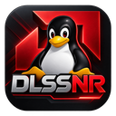
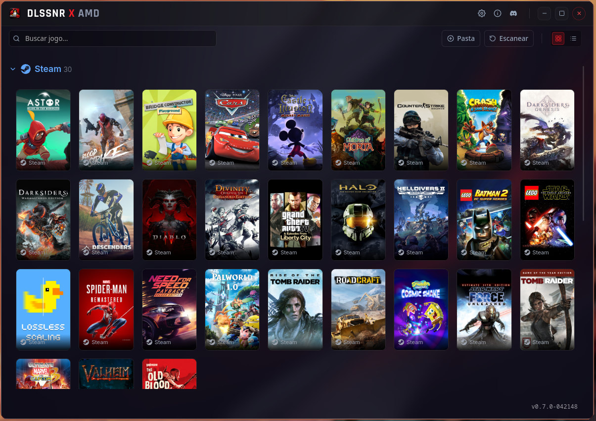

**[🇧🇷 Português](README.md) | 🇺🇸 English**

<p align="center">
  
</p>

# DLSSNR X AMD

**Graphical frontend (launcher) for DLSS Neural Rendering on AMD GPUs running Linux**, developed by [Pelicano · pelicanux](https://github.com/pelicanux).

A graphical interface to organize your library, configure the AI model, and install, repair, update, or remove the mod from your games. Installation operations are performed by the **DLSSNR-AMD** project's installer, authored by **mochizuki0323**, which runs behind the interface. The launcher integrates the [DLSSNR-AMD](https://github.com/mochizuki0323/DLSSNR-AMD) and [DLSSNR-RDNA3](https://github.com/mauri870/DLSSNR-RDNA3) backends; the neural rendering implementation belongs to those projects.

**[Download the launcher](https://github.com/pelicanux/dlssnr-x-amd-launcher/releases)** · **[MIT license](LICENSE)** · **[Credits and licenses](#credits-and-licenses)**

## Interface



Example of the library in grid view, with the interface in Portuguese. The games and cover art shown depend on the user's library.

## Download and installation

Packages are available in the **[distribution repository's Releases](https://github.com/pelicanux/dlssnr-x-amd-launcher/releases)**. This repository contains the launcher's source code.

| Format | Usage |
| --- | --- |
| **AppImage** | Portable Linux package. Allow the file to run as an executable, then open it. |
| **DEB** | Install using the package manager on Debian, Ubuntu, or compatible derivatives. |
| **RPM** | Install using the package manager on Fedora or other compatible distributions. |

Choose the package that matches your computer's architecture. Available formats and architectures are listed in each Release's assets.

### First launch

1. Open the launcher and choose a backend in the initial setup: **DLSSNR-AMD** or **DLSSNR-RDNA3**.
2. Download the backend files through the interface or select available local files.
3. Under **AI Model Source**, select your existing `dlssnr.bin` or the DLL from which you want to extract the model.
4. Complete the setup, select a game, and check its folder, architecture, and installation route.
5. Install the mod. If the result provides Steam/Proton launch options, follow the instructions for your selected route.

The launcher's packages do not include the backend or the AI model. Users must supply the model; the DLL version and runtime requirements must follow the selected backend's documentation.

### Compatibility

| Launcher option | Responsible project | Intended GPU family |
| --- | --- | --- |
| DLSSNR-AMD | [mochizuki0323/DLSSNR-AMD](https://github.com/mochizuki0323/DLSSNR-AMD) | RDNA 4 / Radeon RX 9000 |
| DLSSNR-RDNA3 | [mauri870/DLSSNR-RDNA3](https://github.com/mauri870/DLSSNR-RDNA3) | RDNA 3 / Radeon RX 7000 |

Mod compatibility depends on the backend, GPU, drivers, Wine/Proton version, and game. Finding a game in the library does not guarantee that it supports the mod. Check the requirements and limitations in the original projects before installing.

Installation modifies files in the game folder. Preserve your original files and do not use the mod in online games with anti-cheat, as advised by the [original backend](https://github.com/mochizuki0323/DLSSNR-AMD#before-you-use-it).

## Development and building

The project uses **React, TypeScript, and Vite** for the interface and **Rust with Tauri 2** for the native layer.

Requirements:

- Rust and Cargo.
- Bun, used by the development and build commands configured in the project.
- To build RPM packages, `rpm`, `rpmbuild`, and `cpio` (in the build environment or on the Distrobox host).
- Linux development libraries required by Tauri 2. See the [official prerequisites for your distribution](https://v2.tauri.app/start/prerequisites/#linux).

```bash
git clone https://github.com/pelicanux/dlssnr-x-amd-launcher.git
cd dlssnr-x-amd-launcher
bun install
bun run tauri dev
```

Build all configured Linux package formats:

```bash
bun run tauri build
```

Or build only the AppImage:

```bash
bun run tauri build --bundles appimage
```

DEB and RPM packages install the executable in `/opt/dlssnr-x-amd/dlssnr-x-amd`. The `/usr/bin/dlssnr-x-amd` command is a small wrapper that launches this executable. GTK and WebKitGTK remain system dependencies. Updating asks for confirmation in the launcher before installing the package and restarting.

Packages are generated in `src-tauri/target/release/bundle/`, under the `appimage`, `deb`, and `rpm` subdirectories. When using `bun run tauri build` (including `--bundles appimage`), newly generated packages and the executable are also copied automatically to `release/` at the project root for local use.

### Code structure

| Path | Contents |
| --- | --- |
| `src/` | React/TypeScript interface, components, translations, and frontend services. |
| `src-tauri/` | Rust/Tauri application, game discovery and analysis, backend integration, and updates. |
| `licenses/` | Copies of the backend's original license and third-party notices. |
| `scripts/publish-release.sh` | Package publishing to the distribution repository. |
| `install.sh` | Local installation of the launcher itself and its shortcut; this is not the installer for the mod in games. |

## Credits and licenses

### Launcher and backend authorship

| Project | Authorship and contribution | License and notices |
| --- | --- | --- |
| **DLSSNR X AMD** | [Pelicano · pelicanux](https://github.com/pelicanux): frontend and graphical interface of the launcher on Linux. | [MIT — Copyright (c) 2026 Pelicano](LICENSE) |
| **DLSSNR-AMD** | [mochizuki0323](https://github.com/mochizuki0323): original mod backend and installer, including the model tools used by the interface. | [Original MIT license](https://github.com/mochizuki0323/DLSSNR-AMD/blob/main/LICENSE) · [Preserved copy](licenses/DLSSNR-AMD-LICENSE.txt) |
| **DLSSNR-RDNA3** | [mauri870](https://github.com/mauri870): RDNA 3 fork, derived from mochizuki0323's work. | [Fork's MIT license](https://github.com/mauri870/DLSSNR-RDNA3/blob/main/LICENSE) · [Preserved copy](licenses/DLSSNR-RDNA3-LICENSE.txt) |

Pelicano is responsible for the frontend; mochizuki0323 authored the original installer and backend, with the RDNA3 fork maintained by mauri870. Original copyright notices are preserved, including **Copyright (c) 2026 mochizuki0323** in the RDNA3 fork's license text. The application also provides access to the original texts under **About → Licenses and notices**, including offline access.

### Launcher technologies

| Technology | Project | License |
| --- | --- | --- |
| React | [facebook/react](https://github.com/facebook/react) | MIT |
| Tauri 2 | [tauri-apps/tauri](https://github.com/tauri-apps/tauri) | MIT or Apache-2.0 |
| Motion / Framer Motion | [motiondivision/motion](https://github.com/motiondivision/motion) | MIT |
| TypeScript | [microsoft/TypeScript](https://github.com/microsoft/TypeScript) | Apache-2.0 |
| Vite | [vitejs/vite](https://github.com/vitejs/vite) | MIT |

These technologies and their dependencies retain their original notices. This table lists the main libraries and tools; it does not replace the full licenses of all dependencies.

### Components used by the backend

The backend uses components with their own licenses. Components documented by the original project include:

| Component | Source project | License listed by the backend |
| --- | --- | --- |
| DLSS5-Feeder | [jlrouzies-fr/DLSS5-Feeder](https://github.com/jlrouzies-fr/DLSS5-Feeder) | MIT |
| OptiScaler-NR | [wilsjo2/OptiScaler-DLSSNR-PreSR-Multipass](https://github.com/wilsjo2/OptiScaler-DLSSNR-PreSR-Multipass) | GPL-3.0 |
| ReShade and associated shaders | [crosire/reshade](https://github.com/crosire/reshade) · [crosire/reshade-shaders](https://github.com/crosire/reshade-shaders) | BSD-3-Clause |
| vort_Shaders | [vortigern11/vort_Shaders](https://github.com/vortigern11/vort_Shaders) | MIT |
| MinHook | [TsudaKageyu/minhook](https://github.com/TsudaKageyu/minhook) | BSD-2-Clause |
| Dear ImGui | [ocornut/imgui](https://github.com/ocornut/imgui) | MIT |
| Vulkan-Loader and Vulkan-Headers | [KhronosGroup/Vulkan-Loader](https://github.com/KhronosGroup/Vulkan-Loader) · [Vulkan-Headers](https://github.com/KhronosGroup/Vulkan-Headers) | Apache-2.0; Headers also under MIT |

This table summarizes the backend's notices; it is not a list of files included in the launcher's packages. Consult the [copy of the third-party notices](licenses/DLSSNR-AMD-THIRD-PARTY.md), the [original third-party documentation](https://github.com/mochizuki0323/DLSSNR-AMD/blob/main/THIRD_PARTY.md), and the licenses accompanying each downloaded version. Components such as OptiScaler-NR **do not become MIT-licensed** by being integrated with this launcher.

### AI model and trademarks

The `nvngx_dlssnr.dll` file and the model weights are NVIDIA's property and are not distributed in this repository or the launcher's packages. The launcher's MIT license does not apply to those files or grant rights to them.

This is an independent project, with no official affiliation, endorsement, or support from NVIDIA, AMD, Valve/Steam, Epic Games, GOG, Heroic, or SteamGridDB. DLSS and other trademarks mentioned belong to their respective owners.

## Launcher license

The **DLSSNR X AMD** launcher's own code is available under the **[MIT license](LICENSE)**. It permits using, studying, modifying, forking, and redistributing the code, including commercially, while preserving the copyright notice and license text in distributed copies or substantial portions. The software is provided without warranty, as stated in the license.

Third-party components retain their respective licenses and distribution terms. See also the [license index](licenses/README.md).

## Contributions and issue reports

Bug fixes, translations, interface improvements, and integration contributions are welcome through issues and pull requests.

When reporting a problem, include the launcher version, Linux distribution, GPU, Wine/Proton version, game, backend, and installation route. Provide steps to reproduce and relevant logs, removing personal keys and private data before sharing. Issues specific to neural rendering should also be checked against the corresponding backend project.
